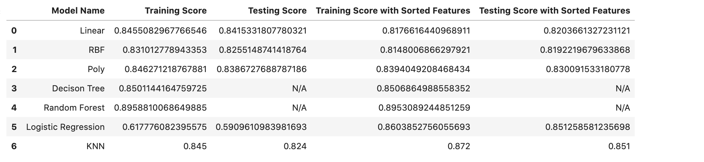

# Machine-Learning-Challenge:  Exoplanet Exploration

## Background

Over a period of nine years in deep space, the NASA Kepler space telescope has been out on a planet-hunting mission to discover hidden planets outside of our solar system.
This dataset is a cumulative record of all observed Kepler "objects of interest" — basically, all of the approximately 10,000 exoplanet candidates Kepler has taken observations on.

This dataset has an extensive data dictionary, which can be accessed here. Highlightable columns of note are:

* kepoi_name: A KOI is a target identified by the Kepler Project that displays at least one transit-like sequence within Kepler time-series photometry that appears to be of astrophysical origin and initially consistent with a planetary transit hypothesis
* kepler_name: [These names] are intended to clearly indicate a class of objects that have been confirmed or validated as planets—a step up from the planet candidate designation.
* koi_disposition: The disposition in the literature towards this exoplanet candidate. One of CANDIDATE, FALSE POSITIVE, NOT DISPOSITIONED or CONFIRMED.
* koi_pdisposition: The disposition Kepler data analysis has towards this exoplanet candidate. One of FALSE POSITIVE, NOT DISPOSITIONED, and CANDIDATE.
* koi_score: A value between 0 and 1 that indicates the confidence in the KOI disposition. For CANDIDATEs, a higher value indicates more confidence in its disposition, while for FALSE POSITIVEs, a higher value indicates less confidence in that disposition.

The process of analyzing and arriving to conclusion involves these main 3 steps:

### Preprocess the Data
Data was preprocessed with MinMaxScaller. Then, different models like linear, RBF, Poly,Decision Tree, Random Forest,Logistic Regression and KNN were trained. 
### Tune Model Parameters
Among trained models, random forest model had the heighest testing and training data scores. Therefore, this model was chosen to be tuned by running feature importance test, which resulted in the following:

### Reporting
Based on models results after tuning, random forest model performed the best. Here's the result of testing before and after sorted features in tuning:
* Testing Result with all features:

* Testing Result with sorted top 10 features:

In conclusion, after analyzing test results, one can conclude that features with the greatest importance make random forest model work efficiently and get higher/same presicion results. 

All the scores before and after sorted features have been summarized in the table below:

Some highlights of the tuning worth knowing is that GridSearchCV suggested best parameters like number of estimators (n_estimators) is 100, and when min_samples_split is 3, model performs the most efficient. Therefore, using this tuning, random forest model was rerun to get minor increase in  training and testing scores for KNN, Logistic Regression, and Random Forest models. On the other hand, using sorted features for models like Linear, RBF, Poly, and Decision Tree decreased training and testing scores. To conclude, we can say that when all features are used the precision scores for categorical variables (Confirmed, False_positive and candidate) are slighly higher when only top 10 features are used, both averiging to accuracy precision with the same score. I would use sorted features to run different models for cases when data has more columns/features given for efficientsy reason.
